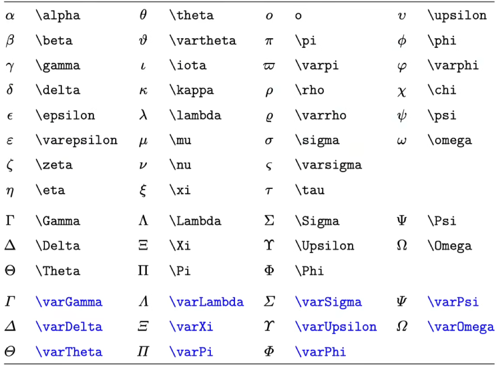
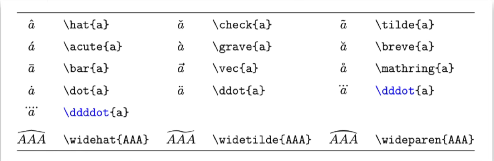
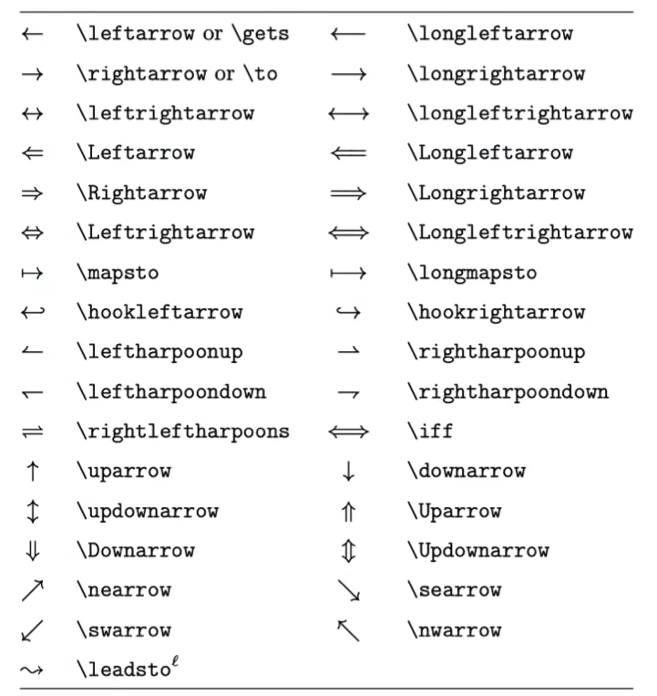
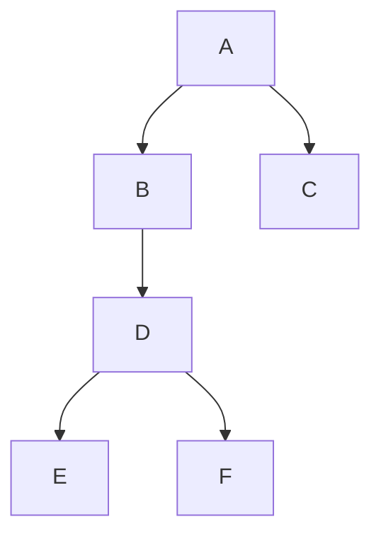
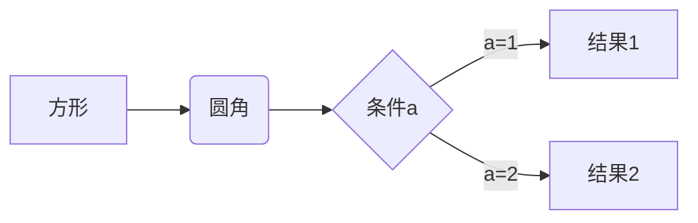
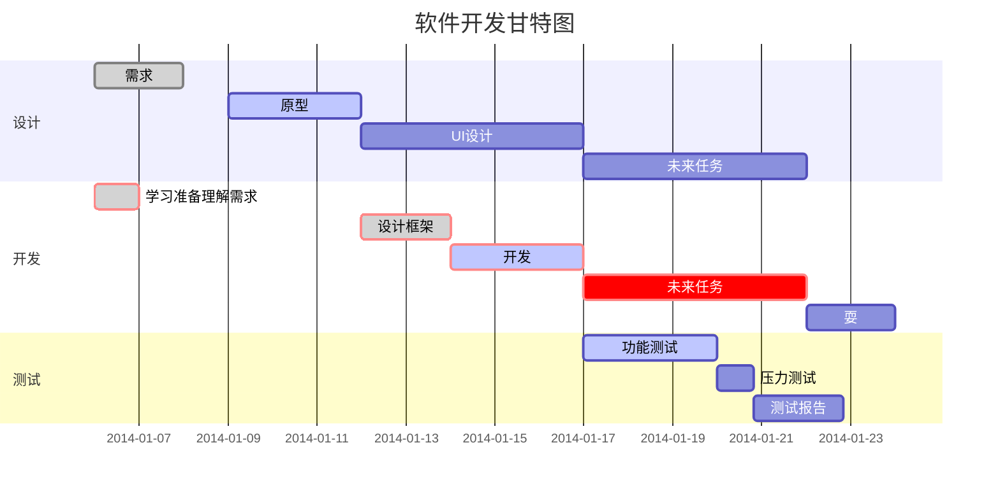
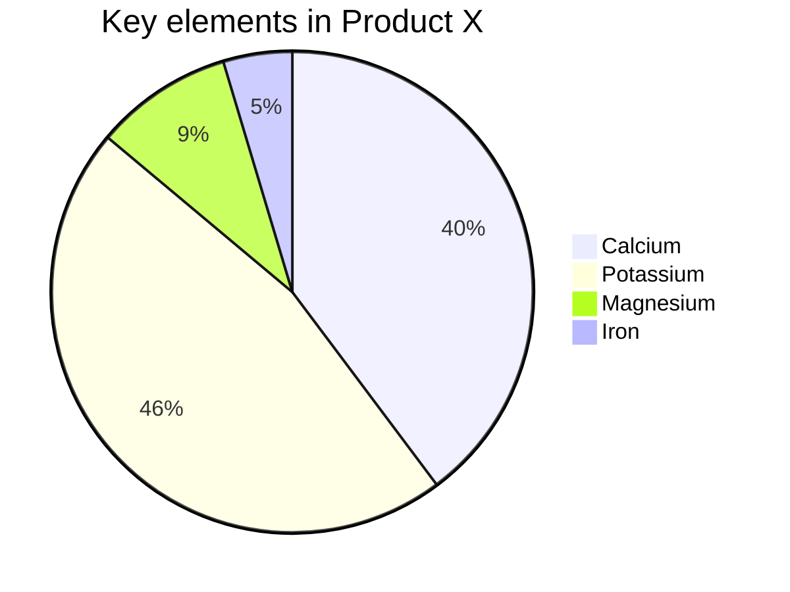

[toc]

# Latex公式


## 希腊字母

$$
\delta,\lambda\\
\Delta,\Lambda\\
\Alpha\Beta\\
\phi,\varphi\\
\epsilon,\varepsilon\\
π
$$



## 上下标

$$
a^2_2,a_1\\
x^{y+z},p_{ij},p_ij\\
x_i,x_{\text i}\\
\text{A B},\rm{A B}\\
\text A B,\rm A B\\
{\rm A} B\\
\text{e},\text{i}
$$


## 分式与根式

$$
\frac{1}{2},\frac 1 2,\\
\frac 1 {x+y}\\
\frac {\dfrac 1 x + 1}{y + 1}
$$

$$
\sqrt 2,\sqrt{x+y},\sqrt[3]x
$$


## 普通运算符

$$
+-\\
\times,\cdot,\div\\
\pm,\mp\\
><,\ge,\le,\gg,\ll,\ne,\approx,\equiv\\
\cap,\cup,\in,\notin,\subseteq,\subsetneqq,\varnothing\\
\forall,\exists,\nexists\\
\because,\therefore\\
\mathbb R,\R,\Q,\N,\Z_+\\
\mathcal F,\mathscr F
$$

$$
\cdots,\vdots,\ddots
$$

$$
\infty,\partial,∂,\nabla,\propto,\degree
$$

$$
\sin x,\sec x,\cosh x\\
\log_2 x, \ln x,\lg x\\
\lim\limits_{x \to 0} \frac { x}{\sin x}\\
\max x
$$

$$
\text{MSE}(x)
$$


## 大型运算符

$$
\sum,\prod\\
\sum_i,\sum_{i=0}^N\\
\frac{\sum\limits_{i=1}^n x_i}{\prod\limits_{i=1}^n x_i}
$$

$$
\int,\iint,\iiint,\oint,\oiint\\
\int_{-\infty}^0 f(x)\,\text d x
$$

$$
a\, a\\
a\ a\\
a\quad a\\
a\qquad a
$$


## 标注符号

$$
\vec x,\overrightarrow {AB}\\
\bar x,\overline{AB}
$$



## 箭头

$$
\leftarrow,\Rightarrow,\Leftrightarrow,\longleftarrow
$$




## 括号与定界符

$$
([])\{ \}\\
\lceil,\rceil,\lfloor,\rfloor,||\\
\left(0,\frac 1 a\right]\\
\left.\frac {∂f}{∂x}\right|_{x=0}
$$


## 多行公式

$$
\begin{align}

a&=b+c+d\\
&=e+f

\end{align}
$$


## 大括号

$$
f(x)=

\begin{cases}

\sin x, & -π\le x \le π\\
0,& \text{其他}

\end{cases}
$$


## 矩阵

$$
\begin{matrix}

a & b & \cdots & c \\
\vdots& \vdots & \ddots & \vdots \\
e & f& \cdots & g

\end{matrix}
$$

$$
\begin{bmatrix}

a & b & \cdots & c \\
\vdots& \vdots & \ddots & \vdots \\
e & f& \cdots & g

\end{bmatrix}

\begin{pmatrix}

a & b & \cdots & c \\
\vdots& \vdots & \ddots & \vdots \\
e & f& \cdots & g

\end{pmatrix}

\begin{vmatrix}

a & b & \cdots & c \\
\vdots& \vdots & \ddots & \vdots \\
e & f& \cdots & g

\end{vmatrix}
$$

$$
\bf A,\bf B^{\rm T}
$$


## 实战演练

$$
f(x) = \frac 1 {\sqrt{2\pi} \sigma} {\rm e} ^ {-\frac {(x-\mu)^2}{2\sigma ^ 2}}\\
f(x) = \frac 1 {\sqrt{2\pi} \sigma} \exp \left[ {-\frac {(x-\mu)^2}{2\sigma ^ 2}}\right]
$$

$$
\lim\limits_{N\to \infty} P \left\{ \left| \frac {I\left( \alpha_i \right)}{N} - H(s) \right| < \varepsilon  \right\} = 1
$$

$$
x(n) = \frac 1 {2\pi} \int _{-π} ^ π X\left( {\rm e} ^ {{\rm j} \omega } \right) {\rm e} ^ {{\rm j} \omega n} \, {\rm d}\omega\\
$$

$$
\begin{align}

\vec B \left( \vec r \right) &= \frac {\mu_0}{4\pi}\oint_C \frac {I \, {\rm d} \vec l \times \vec R}{R^3}\\

&= \frac {\mu_0}{4\pi} \int_V \frac{\vec J_V \times \vec R}{R^3}\, {\rm d} V'

\end{align}
$$

# 补充语法

==高亮，==

:record_button:emoji

:smile:

- [ ] 待办

# 作图

> [参考](https://mermaid.js.org/syntax/gantt.html)

## 流程图

### 竖向



```flow
st=>start: 开始框
 
op=>operation: 处理框
 
cond=>condition: 判断框(是或否?)
 
sub1=>subroutine: 子流程
 
io=>inputoutput: 输入输出框
 
e=>end: 结束框
 
st->op->cond
 
cond(yes)->io->e
 
cond(no)->sub1(right)->op
```


### 横向




```flow
st=>start: 开始框
 
op=>operation: 处理框
 
cond=>condition: 判断框(是或否?)
 
sub1=>subroutine: 子流程
 
io=>inputoutput: 输入输出框
 
e=>end: 结束框
 
st(right)->op(right)->cond
 
cond(yes)->io(bottom)->e
 
cond(no)->sub1(right)->op
```


## 甘特图



## 饼图



## 序列图

```sequence
Alice->Bob: Hello Bob, how are you?
Note right of Bob: Bob thinks
Bob-->Alice: I am good thanks!
```

## 导出

- 绘制好的图片可以选择菜单/文件/导出，导出为图片或者网页格式。
- 在网页中图片是以 SVG 格式渲染的，可以复制 SVG 内容，导入到 SVG 的图片编辑器中进一步操作。

