# week10_design

## 数据库设计概览

如何将「需求」变成最终设计？

---

### 设计阶段

对小型应用，一个数据库的设计者一般可以直接决定要构建的关系、关系的属性及其上的约束。

但现实中的应该一般非常复杂，通常没有一个人能够理解应用的全部需求，所以为了沟通需求，应该将用户的需求分阶段地用某种高级别的方式表示出来，最后再将需求转化为较低级别的设计。

---

### 设计流程

需求分析 → 概念设计 → 逻辑设计 → 物理设计

参考课本 p. 208：图 7.2。

---

### 关于需求

理解用户的需求并不简单，并且可能用户也不知道自己的需求。

---

## E-R 模型

实体（entity）-联系（relationship）模式在将现实世界的需求映射到概念模式上非常有用。

---

#### 历史

In software engineering, an ER model is commonly formed to represent things a business needs to remember in order to perform business processes. Consequently, the ER model becomes an abstract data model, that defines a data or information structure which can be implemented in a database, typically a relational database.

**Peter Pin-Shan Chen**  
陳品山

---

### 实体与实体集

与关系模式类似，实体（entity）通过一组属性表示。

**实体与实体集**

- 实体是现实世界中可区别所有其他对象的一个"事物"或"对象"
- 实体集（entity set）是相同类型的一个实体集合

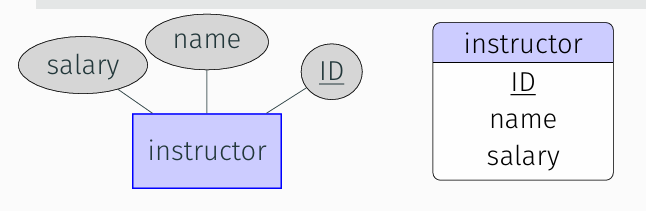

---

### 联系与联系集

**联系与联系集**

- 联系（relationship）是指多个实体间的相互关联
- 联系集（relationship set）是相同类型联系的集合

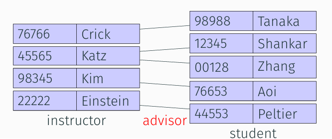

**E-R图**

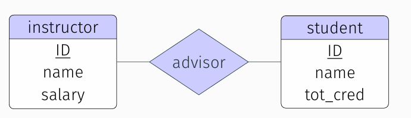

实体集instructor和实体集student及其联系集advisor 的E-R图。

Q: 查询典：矩形和菱形的英文分别怎么说？

A：Rectangle;Diamond

---

#### 练习

考虑 student 实体集和 section 实体集，以及表示「某学生选修了某课程段」的联系 takes。根据上述文字绘制 E-R 图。

**思考：** 成绩（grade）应该属于谁？

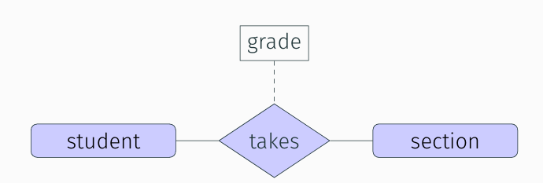

**联系的描述性属性**

E-R 图可能很多页。这样一个实体可能在不同地方出现，只有第一次出现需要属性，其他地方仅出现实体名字就行。

---

### 属性

**域 (domain)**  
对于每个属性，都有一个可允许的取值集合，叫域 (domain)。  

按不同标准，它可以分为：  
- **简单** (simple) 属性：不可再分  
- **复合** (composite) 属性：可以再划分为更小的部分  
- **单值** (single-valued) 属性  
- **多值** (multi-valued) 属性  

#### 属性示例

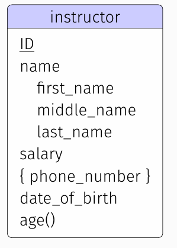

**问题：** 为什么 E-R 图中可以出现复合属性和多值属性，而关系模式要求原子性，不允许表中还有表？

A：E-R和关系模型没有直接绑定联系

---

#### 派生属性

**思考：**  

1. 如果实体集有了生日（birth）属性，那么是否需要年龄（age）属性？x
2. 对于之前的 E-R 图，教师实体集是否需要有「指导了多少名学生」这一属性？x

派生属性一般都不直接存储

---

### 映射基数

#### 定义

映射基数（mapping cardinality）表示一个实体通过一个联系集能关联的实体的个数。

在数据库设计中，`cardinality` 用于描述表之间关系的类型。例如，在[实体关系图](https://zhida.zhihu.com/search?content_id=245381324&content_type=Article&match_order=1&q=实体关系图&zhida_source=entity)（ER 图）中，`cardinality` 描述了实体之间的关联，比如一对一（1:1）、一对多（1:N）和多对多（M:N）。这是数据库设计中非常关键的一部分，因为它决定了数据如何在不同表之间关联和组织。

举个例子，在一个学生管理系统中，学生和课程之间的关系是多对多的：一个学生可以选修多门课程，一门课程也可以有多个学生选修。在这种情况下，学生和课程之间的 `cardinality` 是多对多（M:N）。

映射基数是用来表示：  
- 一个教师能够指导多少学生？
- 一个学生能够被多少教师指导？

---

#### 映射基数类型

1. One-to-One  
2. One-to-Many  
3. Many-to-One  
4. Many-to-Many  

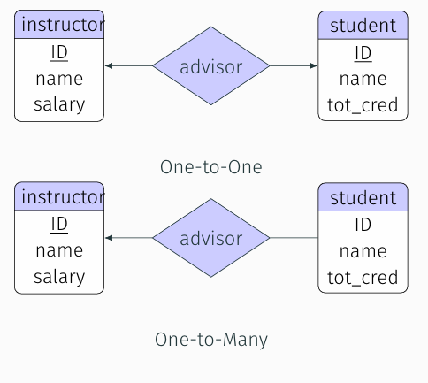

---

### 基数约束

- 约束可以使用一对数 min..max 表示。

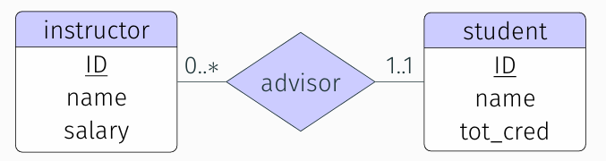

每个教师都恰好有一个学生，且每个学生被0 到多个教师指导

- 实体的「全」参与，使用两条线表示

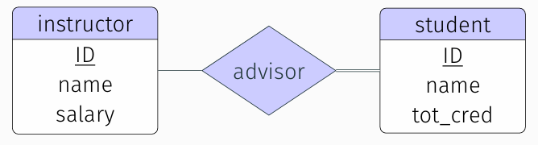

上面的E-R图表示每个学生都有导师。

---

### E-R 软件

#### 在线工具
- LucidChart
- [Draw.io](https://app.diagrams.net/?src=about)（推荐）

#### 专业工具
- IBM Rational Rose Modeler
- Microsoft Visio
- ERWin
- SmartDraw

#### DataGrip 的可化

点击右边栏 tables，右键选择 Diagrams，点击 Show Visualization

---

## 主码

与关系类似，E-R 模型中也有主码的概念，用来唯一标识一个实体或联系。

---

### 实体集的主码

之前学习的"关系模式"的码（包括候选码、主码）的概念可以直接用于实体集。

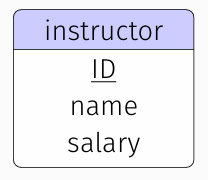

---

### 联系集的主码

联系集的超码：  
PK($E_1$) ∪ PK($E_2$) ∪ ⋯ ∪ PK($E_n$) 构成联系集的超码。

- **情况一：** One-to-Many 或 Many-to-One  
  Many 还是 One 一侧实体集的主码可以构成联系集的主码？
  - Many（不重复）

- **思考：** 对于 One-to-One 和 Many-to-Many 应该如何选择主码？
  - 两个均可；两个都选

---

### 弱实体集

考虑 section，它需要依赖另外一个实体而存在，我们把这样的实体称为弱实体集（weak entity set）。

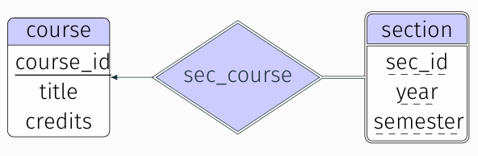

弱实体集的主码由标识实体集（identifying entity set）的主码加上该弱实体集的分辨符（discriminator）构成。

---

### 去除冗余属性

在使用 E-R 模型的时候，要确保实体间不存在冗余属性（a good entity-relationship design does not contain redundant attributes）。

**示例：**  

- instructor(ID, name, dept_name, salary)  
- department(dept_name, building, budget)  

dept_name 在 instructor 中是冗余的，因为它可以通过联系从 department 中获得。

---

**大学数据库**

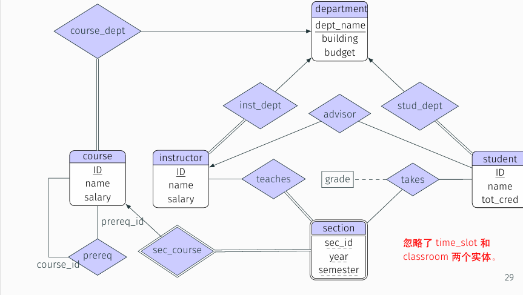

**练习**

考虑NBA比赛中「记录球员参加比赛的得分」这一需求，绘 制E-R图

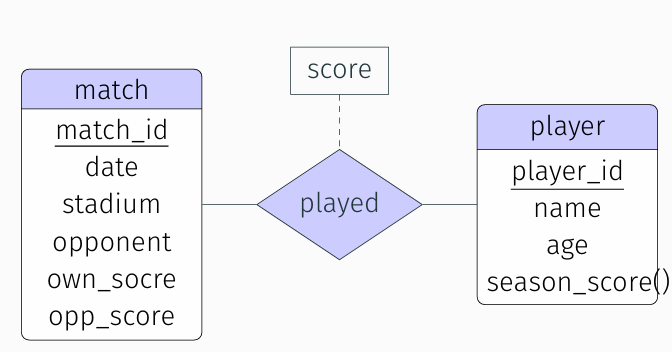

**练习**

考虑一个在线书店应用，要求能够管理！ 

图书，包括标题，ISBN，出版社，作者，价格 

作者，包含 ID，姓名，国籍，年龄，出生年月 

出版社，包括名称，地点 用户，包括 ID，姓名，性别 

购物车，包括ID，总价 

仓库，包括 ID，地点，电话， 

根据上述信息用mermaid绘制ER图。

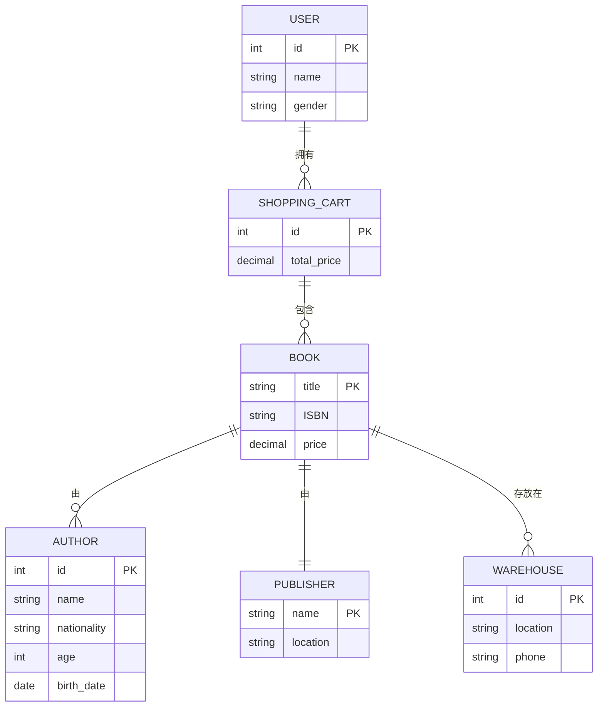

------

## E-R 图转化为关系模式

设计流程：  
需求分析 → 概念设计 → 逻辑设计 → 物理设计

---

### 具有简单属性的强实体集

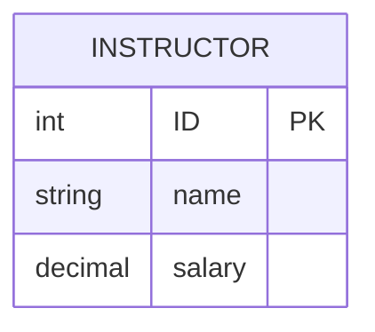

instructor(ID, name, salary)

---

### 具有复杂属性的强实体集

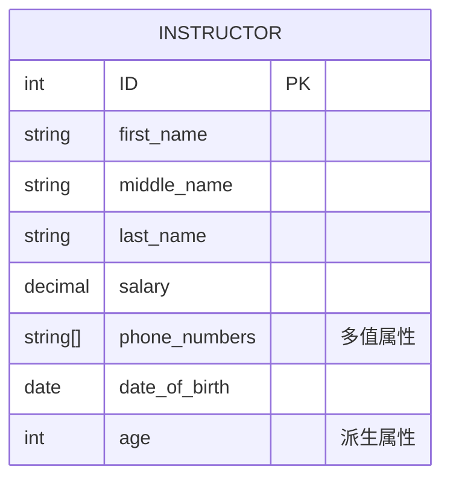

1. instructor(ID, first_name, middle_name, last_name, salary, {phone_number},date_of_birth,age())  
2. instructor_phone(ID, phone_number)  
   - 单独拆出{phone_number}

**思考：** 关系 instructor_phone 的主码是什么？

phone_number(一般应用中ID和phone_number复合作为主码)

---

### 弱实体集

设 A 是具有属性 a₁, a₂, ..., aₘ 的弱实体集，设 B 是 A 所依赖的强实体集，B 的主码包括属性 b₁, b₂, ..., bₙ。那么 A 对应的关系模式包括属性：  
{a₁, a₂, ..., aₘ} ∪ {b₁, b₂, s..., bₙ}

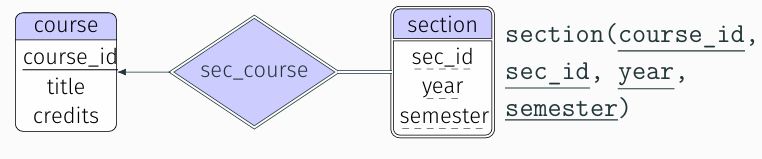

section(course_id, sec_id, year, semester)

属性为:主码+自身属性

---

### 联系集

设 R 是联系集，设 a₁, a₂, ..., aₘ 是所有参与 R 的实体集的主码的并集，设 R 的描述性属性（如果有）为 b₁, b₂, ..., bₙ，那么 R 对应的关系模式包括属性：  
{a₁, a₂, ..., aₘ} ∪ {b₁, b₂, ..., bₙ}

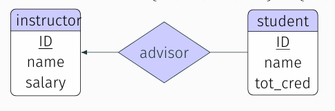

**回忆：** 二元联系中 R 的主码如何选择？

例:为学生的ID

---

### 模式的冗余

连接弱实体集与其依赖的强实体集的联系集的模式是冗余的。

比较 sec_course 和 selction 的关系模式的异同。

---

### 模式的合并

Many-to-One 的联系可以让联系和 Many 一侧的实体合并。

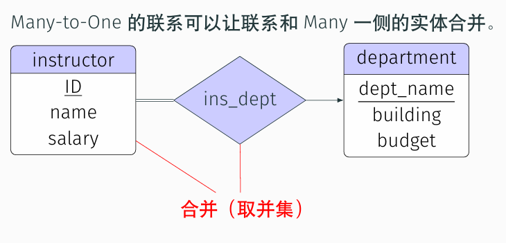 

可以合并为：  
instructor(ID, name, salary, dept_name)

**思考：** One-to-One 的联系能否合并？如果能的话，如何合并？

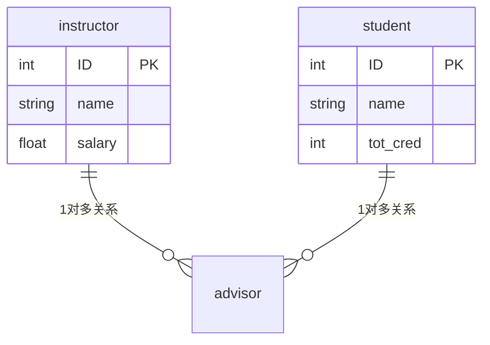

---

## 小结

- E-R 模型  
- 将 E-R 图转化成关系模式  
- E-R 模型的替代品（如 UML 图）