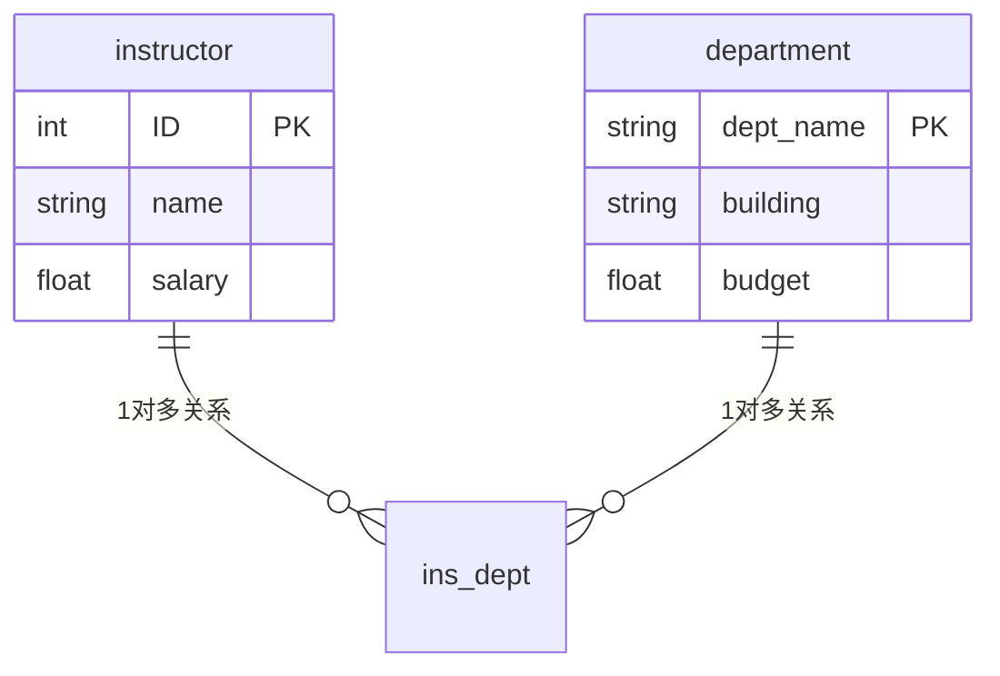

# week11_norm

## 好的设计

### 「大」的模式

**思考：** 为什么不用一个大的模式？即尽可能多地包含属性，比如 `ins_dept` (ID, name, salary, dept_name, building, budget)

**问题：**  
- 数据冗余（如多个教师属于同一学院时，学院信息重复存储）
- 更新异常（修改学院信息需更新多条记录）

---

### 「小」的模式

分解（decomposition）后的「小」模式可以解决冗余问题，但需保证无损分解（lossless decomposition）：
$$
\Pi_{R_1}(r) \bowtie \Pi_{R_2}(r) = r
$$
**示例：**  
employee (ID, name, street, city, salary) 的两种分解方式：

1. ✅ employee1(ID, name) + employee2(ID, street, city, salary)  
2. ❌ employee1(ID, name) + employee2(name, street, city, salary)  

第二种分解可能丢失信息（name不唯一, 同名员工无法区分）。

---

### 当我们说「好」，我们到底在说什么？

**范式（Normal Form）**  
关系模式属于"好的形态"（good form）是指它==没有信息冗余==，通过==范式检查==实现，若不符合则按需==分解==。

**目标：**  

- 消除冗余  
- 保持数据一致性  
- 支持高效查询  

---

### 第一范式（1NF）

**定义：**  
关系模式的所有属性都是原子的（表中每一列的属性都不可再分），即不满足1NF的数据库不是关系数据库。

**示例：**  
| StuID | Name  | Subject      |
| ----- | ----- | ------------ |
| 101   | Alice | OS, Database |
| 102   | Bob   | Music        |

修正为：  
| StuID | Name  | Subject  |
| ----- | ----- | -------- |
| 101   | Alice | OS       |
| 101   | Alice | Database |
| 102   | Bob   | Music    |

---

## 2. 利用函数依赖进行分解

### 函数依赖

**符号表示**

- 属性集:$\alpha$
- 关系模式:$r(R)$
- 超码:$K$

**定义：**  
对于关系模式 $r(R)$，若所有合法实例中满足：  
若 $t_1[\alpha] = t_2[\alpha]$，则 $t_1[\beta] = t_2[\beta]$，  
则称函数依赖 $\alpha \to \beta$ 在 $r(R)$ 上成立。

( 即属性集 $\alpha$ 能够决定属性集 $\beta$ )

**示例：**  
ins_dep(ID, name, salary, dept_name, building, budget) 的函数依赖：  

- ID → name, salary, dept_name  
- dept_name → building, budget  

#### 平凡依赖

- name → name
- ID, name →salary
- salary, name →name

#### 依赖闭包

函数依赖可以进行推断（运算），如从$A→B$和$B→C$可以推断$A→C$。因此，函数依赖可以构成闭包（closure）。我们用$F^+$ 表示集合$F$的闭包。

如: {0,1}加法闭包;减法不闭包

#### 依赖闭包和函数依赖

如果下面至少一个函数依赖属于$F^+$，那么$R_1$和$R_2$就构成了$ R$ 的无损分解：

- $R_1∩R_2→R_1$
- $R_1∩R_2→R_2$

#### 例子

**请说明下面的分解是无损的**： 

ins_dep (ID,name,salary,dept_name, building, budget)

-  instructor(ID,name,salary,dept_name)
- department(dept_name,building, budget)

#### 思考

假设我们将r(R)分解成r1(R1)和r2(R2)，并且R1∩R2→R1。试分析：

- r1的主码是什么？ $R_1∩R_2$
- r2的外码是什么？ $R_1∩R_2$

---

### Boyce-Codd 范式（BCNF）

**定义：**  
关系模式 R 属于 BCNF，当且仅当对 $F^+$ 中所有$\alpha \to \beta$ ：  

1. 是平凡依赖$\beta \subseteq \alpha$ ，或  
2.  $\alpha$ 是超码  (能唯一决定整个关系)

**检查步骤：**  

1. 计算  $\alpha^+$ （闭包）  
2. 验证是否包含 $ R $ 的所有属性  

**示例：**  
ins_dep 不满足 BCNF（dept_name 不是超码），需分解为：  

- instructor(ID, name, salary, dept_name)  
- department(dept_name, building, budget) 

**练习2**

 假设一个老师有多个地址，请对下面的关系模式进行分解，使 其满足BCNF。 inst(ID,name,street,city)

|  ID   | name | street | city |
| :---: | :--: | :----: | :--: |
| 22222 | Bob  |  柳林  | 成都 |
| 22222 | Bob  |  光华  | 成都 |
| 33333 | Mike | 东川路 | 上海 |

ID非超码: 2222重复

为了满足 BCNF，将 `inst(ID, name, street, city)` 分解为：

1. **`inst_info(ID, name)`**：
   - 主键：`ID`。
   - 函数依赖：`ID → name`。
2. **`inst_address(ID, street, city)`**：
   - 主键：`{ID, street, city}`。
   - 无非平凡函数依赖。

---

### 第三范式（3NF）

**定义：**  
比 BCNF 宽松，允许 $\beta - \alpha$ 的每个属性属于某个候选码。

**权衡：**  

- BCNF：消除所有冗余，但可能丢失依赖保持性  
- 3NF：保留依赖，允许少量冗余  

**示例：**  
dept_advisor(s_ID, i_ID, dept_name) 满足 3NF 但不满足 BCNF。

---

### BCNF 分解算法

**算法步骤：**  
1. 若存在非平凡依赖 \( $\alpha \to \beta$ \) 且 \( $\alpha$ \) 不是超码，则分解为：  
   - \( $R_1 = \alpha \cup \beta$ \)  
   - \( $R_2 = R - \beta$ \)  
2. 递归检查子模式  

**示例：**  
对 \( $R = (A, B, C, D, E)$ \) 和依赖集 $A \to BC, CD \to E, B \to D, E \to A$：  

1. 分解 \( $R_1 = (A, B, C)$ \)，\( $R_2 = (A, D, E)$ \)  
2. 进一步分解 \( $R_2$ \) 为 \( $(A, E)$ \) 和 \( $(D, E)$ \)  

---

## 小结

- **范式目标**：消除冗余，保持数据一致性  
- **关键概念**：  
  - 无损分解  
  - 函数依赖  
  - BCNF 与 3NF 的权衡  
- **设计流程**：分析依赖 → 检查范式 → 按需分解  