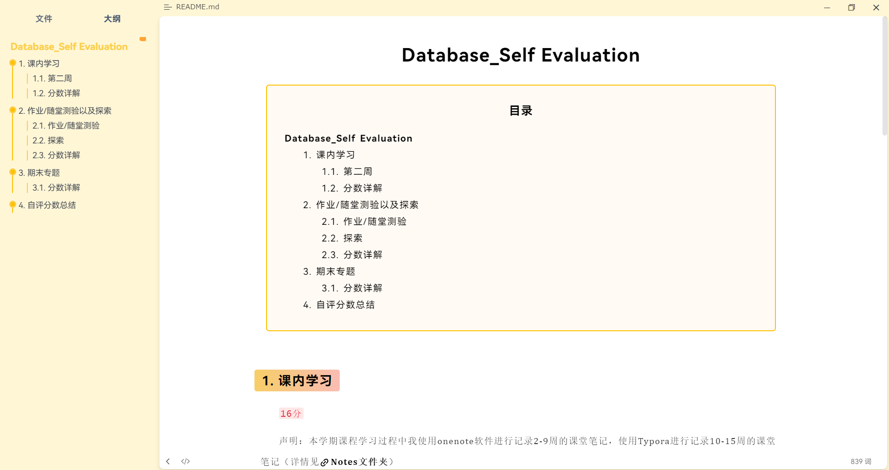

# Database_Self Evaluation

## 课内学习

### 写在前面

声明：本学期课程学习过程中我使用了onenote软件进行记录2-9周的课堂笔记，使用了md文件进行记录10-15周的课堂笔记（详情见[Notes文件夹](https://github.com/SrilankaDyingDark/Database_SelfEvaluation/tree/main/Notes)）

### 第二周

- **学习内容**：关系模型，包括关系数据库，码（key）/键与关系代数

- **[学习笔记](https://github.com/SrilankaDyingDark/Database_SelfEvaluation/blob/main/Notes/%E5%85%B3%E7%B3%BB%E6%A8%A1%E5%9E%8B.one)**：部分展示如下

  > **关系数据库**
  >
  > 1. 关系数据库的结构
  > 2. - 关系（relation）-表
  >
  >   - 元组（tuple）-行
  >
  >   - 属性（attribute）-列
  >
  >   - - 关系是元组的集合
  >      - 元组顺序不重要，元组可重复
  >
  > 3. 关系模式
  > 4. 1. Relation:the name of a relation and the set of  attributes for a relation
  >    2. 例：Instructor(ID,name,dept_name,salary)


- **所思所想**：第一次了解到数据库时就感觉关系数据库好像一个Excel表plus版本，with更严格的定义限制。

### 第三~六周

- **学习内容**：定义关系、查询关系、修改数据库

- **[学习笔记](https://github.com/SrilankaDyingDark/Database_SelfEvaluation/blob/main/Notes/%E5%88%9D%E7%BA%A7SQL.one)**：部分展示如下

  > - 删除
  >
  > - - 删除表：drop table r;
  >   - 清空数据保留表：delete from r;
  >
  > - 自动增加ID：SERIAL
  >
  > - ```sql
  >   CREATE TABLE product (
  >       
  >     product_no SERIAL PRIMARY KEY,
  >       
  >     name VARCHAR(100),
  >       
  >     price NUMERIC(10, 2)
  >       
  >   );
  >   ```
  >
  > - 注意：
  >
  > - - 关系名、属性名及关键字（keyword）不区分大小写，但一般关键词用大写。
  >   - 全部使用英文半角字符

- **所思所想**：SQL的语法没有太多限制，不区分大小写甚至无所谓缩进这一点让我十分吃惊，因为无论是python还是R都会严格要求缩进，感觉SQL是很自由的一门语言。

### 第七~九周

- **学习内容**：Join、视图、

- **[学习笔记](https://github.com/SrilankaDyingDark/Database_SelfEvaluation/blob/main/Notes/%E4%B8%AD%E7%BA%A7SQL.one)**：部分展示如下

  > 1. 自然连接(natural join）
  > 2. ​		找到学生名字及其所选课程ID
  >
  > 3. ```sql
  >    --相同名称属性的值相等
  >    SELECT name, course_id
  >    FROM student,takes
  >    WHERE student.id=takes.id;
  >    --两种写法没有区别
  >    SELECT name, course_id
  >    FROM student NATURAL JOIN takes;
  >    ```
  >
  > 2. 没有选课的学生会出现在结果吗？
  >
  > 1. ​		不会，空值作为条件比较不会出现，只保留两个表存在且属性相同的行，空值不存在则不出现

- **所思所想**：学习多表连接时，我了解到当学生表和课程表都有 dept_name 时，若盲目用 NATURAL JOIN 会意外引入非预期的匹配条件，这验证了“连接的本质是集合运算，而非单纯的字段对齐。

### 第十~十一周

- **学习内容**：高级数据类型、类型转换、授权、注入攻击

- **[学习笔记](https://github.com/SrilankaDyingDark/Database_SelfEvaluation/blob/main/Notes/week10_design.md)**：部分展示如下

  > 1. 日期和时间类型
  >
  >    1. 输出现在时间、时区
  >
  >       ```sql
  >       SELECT current_date, current_time, current_timestamp;
  >       
  >       SELECT current_time at time zone 'CCT';
  >       SELECT current_time at time zone'Asia/Shanghai';
  >       ```
  >
  >    2. 如何得到2008年8月8日距今有多少天？距今 100天后是哪天？
  >
  >       ```sql
  >       SELECT CURRENT_DATE - DATE '2008-08-08';
  >       SELECT CURRENT_DATE + 100;
  >       ```
  >
  > 2. 小数精度问题
  >
  > 3. 1. 浮点数不精确
  >    2. 建议使用 numeric或者 decimal

- **所思所想**：发现直接使用 `timestamp` 会丢失时区信息。通过 `current_time at time zone 'Asia/Shanghai'` 实验才理解"时间数据本质是带上下文的量值"。

### 第十一~十五周

- **学习内容**：设计、概念、理论
- **[学习笔记](https://github.com/SrilankaDyingDark/Database_SelfEvaluation/blob/main/Notes/week10_design.md)**
- **所思所想**：这一部分理论学习对我来说难度很大，关于范式在上课时我没有太理解，课后在b站找了几个视频来学习，也还是有些似懂非懂。在论及是否存储教师年龄时，考虑是否能通过生日计算就不该存储，结合派生属性原则，最终仍然要存储年龄字段这一点让我理解到好设计"终究要服务于具体场景”。

### 分数详解

在本学期的前十一周我的学习比较认真，每一堂课都仔细做了笔记，虽然学了忘忘了学，但是总的来看还是基本达到我自身的要求；但在后期讲到理论时，由于理解上的困难我的学习效果并不是很理想，因此扣除2分。小计`18分`

## 作业/随堂测验以及探索

### 作业/随堂测验

- [Homework01](https://github.com/SrilankaDyingDark/Database_SelfEvaluation/blob/main/Homework%26Test/%E7%AC%AC%E4%B8%80%E6%AC%A1%E4%BD%9C%E4%B8%9A.docx)
- [Homework02](https://github.com/SrilankaDyingDark/Database_SelfEvaluation/blob/main/Homework%26Test/%E7%AC%AC%E4%BA%8C%E6%AC%A1%E4%BD%9C%E4%B8%9A.docx)
- [Homework03](https://github.com/SrilankaDyingDark/Database_SelfEvaluation/blob/main/Homework%26Test/%E7%AC%AC%E4%B8%89%E6%AC%A1%E4%BD%9C%E4%B8%9A.docx)
- [Homework04](https://github.com/SrilankaDyingDark/Database_SelfEvaluation/blob/main/Homework%26Test/%E7%AC%AC%E5%9B%9B%E6%AC%A1%E4%BD%9C%E4%B8%9A.docx)
- [Homework05](https://github.com/SrilankaDyingDark/Database_SelfEvaluation/blob/main/Homework%26Test/%E7%AC%AC%E4%BA%94%E6%AC%A1%E4%BD%9C%E4%B8%9A.docx)
- [test](https://github.com/SrilankaDyingDark/Database_SelfEvaluation/blob/main/Homework%26Test/%E8%AF%BE%E5%A0%82%E6%B5%8B%E8%AF%95.docx)
- [Homework07](https://github.com/SrilankaDyingDark/Database_SelfEvaluation/blob/main/Homework%26Test/%E7%AC%AC%E5%85%AD%E6%AC%A1%E4%BD%9C%E4%B8%9A.docx)
- [Homework08](https://github.com/SrilankaDyingDark/Database_SelfEvaluation/blob/main/Homework%26Test/%E7%AC%AC8%E6%AC%A1%E4%BD%9C%E4%B8%9A.md)

在本门课程的学习中，我认真完成了每一次作业，每一次作业对我来说都是一次知识的收获，同时在对问题有疑惑时我与AI大模型进行了探讨，不得不感叹AI比我学的好（bushi）。在第一周的作业中，下载DATAGRIP时我遇到了很大的困难，为使用学生认证需要跳转链接，而当时我尝试了重启软件、重启电脑、使用热点都打不开跳转链接，后来挂梯子终于跳转成功...好吧只能说下载软件才是最难的orz。在本学期最后一次作业中，我使用了新鲜学会的Markdown语法来写作业，有种之前过的都是什么苦日子的感觉。

### 探索

- **课外学习**：本学期前期，在[自学SQL网](http://www.xuesql.cn/lesson/select_queries_with_constraints)网站上进行了课外的学习，并按照网站提供的练习进行了知识巩固。

- **Github的学习和Desktop的使用**：本学期首次学会了~~白嫖~~克隆仓库（之前只会打包下载zip），并且通过[CSDN的教程](https://blog.csdn.net/TYRA9/article/details/144791691)学习了GithubDesktop的使用，创建了自己的[第一个仓库](https://github.com/SrilankaDyingDark/xyj2077)。我发现协作者如果修改同一个文件，那么会导致文件冲突，在合并时需要先解决冲突才能合并分支。

- **Markdown的学习以及Typora的使用**：通过菜鸟教程网站自学了Markdown与Latex公式语法，并做了[笔记](https://github.com/SrilankaDyingDark/Database_SelfEvaluation/tree/main/Homework%26Test/Explore)记录学习内容。Typora是一个十分简单好上手的md文件编辑器，所见即所得这一点我很喜欢（之前用VScode看md文件要开两个窗口很难受）。在了解了Typora的基础操作之后，我尝试基于官网上的主题对css进行了界面修改，预览如下：

  

### 分数详解

本门课程的作业完成情况和自我探索情况都达到了我自身比较满意的状况，因此这一部分无扣分，小计`10分`

## 期末项目专题

刚拿到题目时简直一头雾水，不知道从什么地方下手，而且感觉和前期的学习内容几乎毫无关联。直到后期课上老师展示了Fastapi我才稍微有些头绪，通过菜鸟教程网站和b站大学大致了解了Fastapi，并且和队友通过多次讨论确定了我们的设计细节，从创建虚拟环境到连接数据库，在此过程中借助了AI大模型进行不断的修正和改进，整个过程就像是拨云见日一样，在一次次的探索中摸清项目的清晰轮廓。

### 分数详解

根据下面TODO的完成情况并考虑到过程中的投入和付出，综合自评小计`19分`

- [x] 创建虚拟环境
- [x] 初步使用Fsatapi并对自动生成的文档进行探索
- [x] 完成基本的增删改查
- [x] 链接DATAGRIP，使用SQL生成随机数据，并在api文档中利用生成数据进行测试
- [x] 完成题目中其他的功能
- [x] 论文写作

## 自评分数总结

`总计18+10+19=47`
